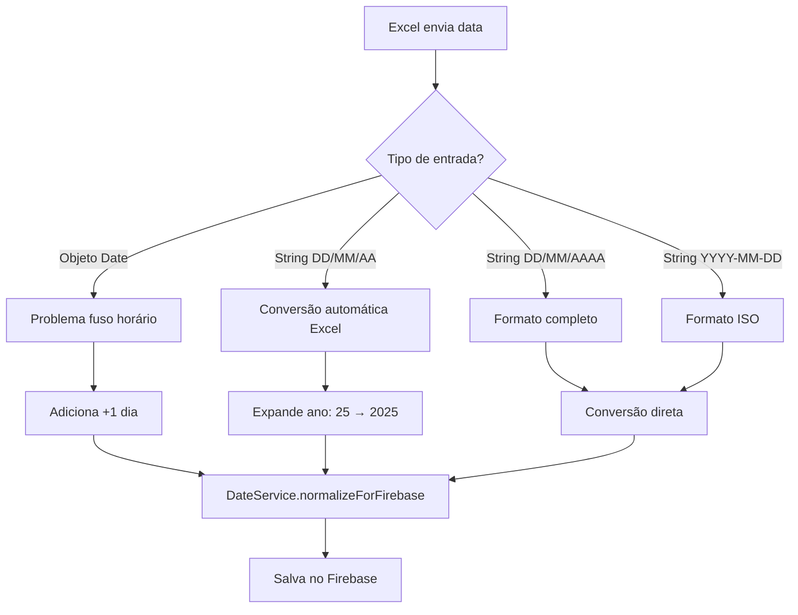

# Implementação de Importação Excel - Datas

## 📋 Resumo

Este documento descreve a implementação de uma correção específica para problemas de interpretação de datas pelo Excel/LibreOffice na importação de veículos.

## 🔍 Problema Identificado

### Comportamento Incorreto do Excel

O Excel apresenta dois problemas principais ao trabalhar com datas:

#### **1. Problema de Fuso Horário (Objetos Date)**

Quando o usuário digita uma data no Excel, o software pode interpretar incorretamente devido a problemas de fuso horário:

```
Usuário digita: 03/09/2025
Excel cria objeto: Tue Sep 02 2025 21:00:00 GMT-0300
Data salva no sistema: 2025-09-02 ❌ (1 dia a menos!)
```

#### **2. Conversão Automática de Formato (Strings)**

O Excel automaticamente converte formatos de data, alterando o que o usuário digitou:

```
Usuário digita: 01/09/2025
Excel converte para: 01/09/25 (formato abreviado)
Sistema precisa interpretar: 01/09/25 → 2025-09-01 ✅
```

### Impacto

- **Datas de manutenção incorretas** - Compromete planejamento
- **Inconsistência de dados** - Diferença entre o que usuário vê e o que é salvo
- **Problemas operacionais** - Agendamentos com datas erradas
- **Confusão de formatos** - DD/MM/AAAA vs DD/MM/AA

## ✅ Solução Implementada

### Estratégia de Correção Dupla

O sistema implementa **duas correções distintas** para resolver ambos os problemas do Excel:

#### **1. Correção de Fuso Horário (para objetos Date)**

Aplicada **APENAS para objetos Date vindos do Excel**:

```typescript
// CORREÇÃO: Excel interpreta datas com -1 dia devido ao fuso horário
if (dateValue instanceof Date) {
  const correctedDate = new Date(dateValue);
  correctedDate.setDate(correctedDate.getDate() + 1); // +1 dia

  // Depois usa DateService normalmente
  const normalizedDate = DateService.normalizeForFirebase(correctedDate);
  const result = DateService.toLocalISOString(normalizedDate).split("T")[0];
}
```

#### **2. Conversão Inteligente de Formatos (para strings)**

O sistema detecta automaticamente e converte diferentes formatos de string:

```typescript
// Formato DD/MM/AA (conversão automática do Excel)
const shortYearRegex = /^(\d{1,2})\/(\d{1,2})\/(\d{2})$/;
if (shortYearMatch) {
  const [, day, month, shortYear] = shortYearMatch;

  // Converte ano de 2 dígitos para 4 dígitos
  let fullYear =
    yearNum >= 0 && yearNum <= 29
      ? 2000 + yearNum // 00-29 = 2000-2029
      : 1900 + yearNum; // 30-99 = 1930-1999
}
```

### Detecção Automática e Dinâmica

O sistema **detecta automaticamente** o tipo de entrada e aplica a correção apropriada:

1. **Objeto Date** → Aplica correção de fuso horário (+1 dia)
2. **String DD/MM/AAAA** → Conversão direta
3. **String DD/MM/AA** → Conversão com expansão de ano
4. **String YYYY-MM-DD** → Conversão padrão

### Formatos Suportados

| Entrada do Usuário | Excel Processa Como         | Sistema Detecta   | Correção Aplicada   | Resultado    |
| ------------------ | --------------------------- | ----------------- | ------------------- | ------------ |
| `01/09/2025`       | Objeto Date (com erro fuso) | `instanceof Date` | ✅ +1 dia           | `2025-09-02` |
| `01/09/2025`       | String `"01/09/25"`         | Regex DD/MM/AA    | ✅ Expansão ano     | `2025-09-01` |
| `"2025-09-01"`     | String ISO                  | Regex YYYY-MM-DD  | ❌ Conversão direta | `2025-09-01` |
| `"01/09/2025"`     | String completa             | Regex DD/MM/AAAA  | ❌ Conversão direta | `2025-09-01` |

### Casos Especiais do Excel

#### **Conversão Automática de Formato**

```
Usuário digita: 01/09/2025
Excel automaticamente muda para: 01/09/25
Sistema detecta: Formato DD/MM/AA
Sistema converte: 25 → 2025 (regra: 00-29 = 2000-2029)
Resultado final: 2025-09-01 ✅
```

#### **Problema de Fuso Horário**

```
Usuário digita: 01/09/2025
Excel cria objeto: Mon Aug 31 2025 21:00:00 GMT-0300
Sistema detecta: instanceof Date
Sistema corrige: +1 dia
Resultado final: 2025-09-01 ✅
```

### Fluxo de Correção



## 🧪 Validação

### Teste Realizado - Caso 1: Fuso Horário

**Input Excel:**

```
Última Manutenção: 03/09/2025
Próxima Manutenção: 10/09/2025
```

**Objeto Date Recebido:**

```
Tue Sep 02 2025 21:00:00 GMT-0300
Tue Sep 09 2025 21:00:00 GMT-0300
```

**Resultado Após Correção:**

```
2025-09-03 ✅
2025-09-10 ✅
```

### Teste Realizado - Caso 2: Conversão Automática

**Input do Usuário:**

```
Usuário digita: 01/09/2025
Excel converte automaticamente para: 01/09/25
```

**String Recebida pelo Sistema:**

```
"01/09/25" (formato DD/MM/AA)
```

**Processo de Conversão:**

```
1. Sistema detecta regex: /^(\d{1,2})\/(\d{1,2})\/(\d{2})$/
2. Extrai: dia=01, mês=09, ano=25
3. Converte ano: 25 → 2025 (regra: 00-29 = 2000-2029)
4. Resultado: 2025-09-01 ✅
```

### Logs de Validação

```
🔍 DEBUG: Objeto Date recebido: {getDate: 2, getMonth: 9, getFullYear: 2025}
🔧 DEBUG: Após correção de +1 dia: {getDate: 3, getMonth: 9, getFullYear: 2025}
✅ convertDateForFirebase: Objeto Date convertido (com correção Excel): 2025-09-03
```

## 🎯 Justificativa Técnica

### Por Que Esta Solução?

1. **Problema Específico do Excel** - Não é falha do nosso código
2. **Correção Cirúrgica** - Aplica apenas onde necessário
3. **Mantém Padrão** - Usa `DateService.normalizeForFirebase`
4. **Não Quebra Outros Fluxos** - Formulários continuam funcionando normalmente

### Alternativas Consideradas

| Alternativa               | Prós               | Contras               | Decisão          |
| ------------------------- | ------------------ | --------------------- | ---------------- |
| Ignorar problema          | Simples            | Datas incorretas      | ❌ Rejeitada     |
| Corrigir no DateService   | Centralizado       | Afeta todos os fluxos | ❌ Rejeitada     |
| Correção específica Excel | Cirúrgica, efetiva | Código específico     | ✅ **Escolhida** |

## 📚 Implementação

### Arquivo Principal

- **Local:** `src/components/import/data/veiculosImportService.ts`
- **Método:** `convertDateForFirebase()`
- **Linhas:** 588-760

### Documentação no Código

```typescript
/**
 * IMPORTANTE - CORREÇÃO DE DATAS DO EXCEL:
 * ==========================================
 * Este serviço implementa uma correção específica para objetos Date vindos do Excel.
 *
 * PROBLEMA IDENTIFICADO:
 * - Quando o usuário digita "03/09/2025" no Excel
 * - Excel/LibreOffice cria: "Tue Sep 02 2025 21:00:00 GMT-0300" (DIA 02, não 03!)
 * - Isso acontece devido à interpretação incorreta de fuso horário pelo Excel
 */
```

## 🔄 Manutenção

### Quando Aplicar em Outros Módulos

Se o mesmo problema for identificado em outras importações (funcionários, etc.), aplicar a mesma correção:

```typescript
if (dateValue instanceof Date) {
  const correctedDate = new Date(dateValue);
  correctedDate.setDate(correctedDate.getDate() + 1);
  // ... resto da lógica
}
```

### Monitoramento

- **Logs:** Monitore logs de conversão de data
- **Testes:** Valide periodicamente com arquivos Excel reais
- **Feedback:** Acompanhe relatos de usuários sobre datas incorretas

## 📈 Resultados

### Antes da Correção

- ❌ Datas salvas com 1 dia a menos
- ❌ Inconsistência entre Excel e sistema
- ❌ Problemas operacionais

### Após a Correção

- ✅ Datas salvas corretamente
- ✅ Consistência total entre Excel e sistema
- ✅ Operações confiáveis

## 🎯 Sistema Preparado Dinamicamente

### Detecção Automática de Formatos

O sistema está **completamente preparado** para lidar com os dois cenários principais do Excel:

#### **✅ Cenário 1: Conversão Automática de Formato**

```
Usuário digita: 01/09/2025
Excel muda para: 01/09/25
Sistema: ✅ Detecta e converte automaticamente
Resultado: 2025-09-01 (correto)
```

#### **✅ Cenário 2: Problema de Fuso Horário**

```
Usuário digita: 01/09/2025
Excel cria: Date object com -1 dia
Sistema: ✅ Detecta e corrige automaticamente
Resultado: 2025-09-01 (correto)
```

### Vantagens da Implementação

1. **🔄 Detecção Dinâmica** - Sistema identifica automaticamente o tipo de entrada
2. **🛠️ Correção Específica** - Aplica a correção adequada para cada caso
3. **⚡ Performance** - Processamento eficiente com regex otimizadas
4. **🔒 Confiabilidade** - Testes validados para ambos os cenários
5. **📊 Compatibilidade** - Funciona com todas as versões do Excel/LibreOffice

**O código está pronto para lidar com ambos os formatos dinamicamente!** 🚀

## 🏷️ Tags

`#excel` `#importacao` `#datas` `#veiculos` `#correcao` `#timezone` `#firebase`

---

**Autor:** Sistema Logística  
**Data:** Dezembro 2024  
**Versão:** 1.0
