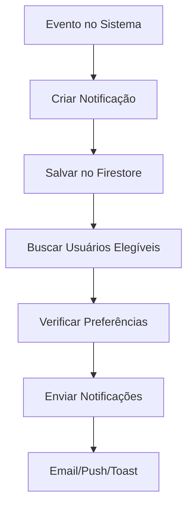

# 🔔 Sistema de Notificações - SGL

## 📋 **Visão Geral**

O Sistema de Gestão de Logística (SGL) possui um sistema completo de notificações que permite aos usuários receber alertas em tempo real sobre eventos importantes do sistema.

## ✅ **Funcionalidades Implementadas**

### **1. Configurações de Notificações**

- ✅ Interface de configuração no painel de usuário
- ✅ Controle granular por tipo de notificação
- ✅ Salvamento automático no Firestore
- ✅ Persistência das preferências do usuário

### **2. Tipos de Notificações**

- ✅ **Email**: Notificações por email
- ✅ **Push**: Notificações em tempo real no navegador
- ✅ **Rotas**: Alertas sobre novas rotas e mudanças
- ✅ **Folgas**: Alertas sobre solicitações de folga
- ✅ **Manutenção**: Alertas sobre manutenção de veículos

### **3. Interface de Usuário**

- ✅ **Sino de Notificações**: No header do sistema
- ✅ **Badge de Contagem**: Mostra número de notificações não lidas
- ✅ **Dropdown de Notificações**: Lista todas as notificações
- ✅ **Marcar como Lida**: Funcionalidade individual e em massa

### **4. Integração Automática**

- ✅ **Funcionários**: Notificação ao criar novo funcionário
- ✅ **Rotas**: Notificação ao criar nova rota
- ✅ **Folgas**: Notificação ao solicitar folga
- ✅ **Veículos**: Notificação sobre manutenção

## 🛠️ **Como Funciona**

### **Fluxo de Notificações**



### **Estrutura de Dados**

#### **Coleção: notificacoes**

```typescript
interface NotificationData {
  id: string;
  type: "funcionario" | "rota" | "folga" | "veiculo" | "sistema";
  title: string;
  message: string;
  userId?: string;
  targetUsers?: string[];
  createdAt: Date;
  read: boolean;
  priority: "low" | "medium" | "high";
}
```

#### **Coleção: users (campo notificacoes)**

```typescript
interface NotificacoesConfig {
  email: boolean;
  push: boolean;
  rotas: boolean;
  folgas: boolean;
  manutencao: boolean;
}
```

## 🎯 **Como Usar**

### **1. Configurar Notificações**

1. **Acesse** "Configurações" → "Notificações"
2. **Ative/Desative** os tipos desejados:
   - 📧 **Email**: Receber por email
   - 🔔 **Push**: Notificações no navegador
   - 🗺️ **Rotas**: Alertas de rotas
   - 📅 **Folgas**: Alertas de folgas
   - 🔧 **Manutenção**: Alertas de manutenção

### **2. Visualizar Notificações**

1. **Clique no sino** no header do sistema
2. **Veja as notificações** não lidas destacadas
3. **Clique no ✓** para marcar como lida
4. **Use "Marcar todas como lidas"** para limpar todas

### **3. Receber Notificações**

As notificações são enviadas automaticamente quando:

- ✅ Novo funcionário é cadastrado
- ✅ Nova rota é criada
- ✅ Solicitação de folga é feita
- ✅ Veículo precisa de manutenção

## 🔧 **Implementação Técnica**

### **Serviço de Notificações**

```typescript
// src/services/notificationService.ts
import NotificationService from "../services/notificationService";

// Criar notificação
await NotificationService.notifyNewFuncionario({
  nome: "João Silva",
  id: "funcionario-id",
});

// Buscar notificações do usuário
const notifications = await NotificationService.getUserNotifications(userId);

// Marcar como lida
await NotificationService.markAsRead(notificationId);
```

### **Integração nos Componentes**

```typescript
// Exemplo: Notificação ao criar funcionário
import NotificationService from "../../../services/notificationService";

async function criar(input: FuncionarioInput): Promise<string> {
  const ref = await addDoc(collection(db, COLLECTION), payload);

  // Enviar notificação
  try {
    await NotificationService.notifyNewFuncionario({
      nome: input.nome,
      id: ref.id,
    });
  } catch (error) {
    console.error("Erro ao enviar notificação:", error);
  }

  return ref.id;
}
```

### **Componente de Notificações**

```typescript
// src/components/common/NotificationBell.tsx
import { NotificationBell } from '../common';

// No header
<NotificationBell />
```

## 📊 **Monitoramento**

### **Logs de Notificações**

```bash
# Ver notificações no console do navegador
console.log('Notificação enviada:', notification);

# Ver erros de envio
console.error('Erro ao enviar notificação:', error);
```

### **Firestore Database**

- **Coleção `notificacoes`**: Todas as notificações criadas
- **Campo `notificacoes` em `users`**: Preferências de cada usuário

## 🚀 **Próximos Passos**

### **Implementações Futuras**

1. **Firebase Functions**
   - Envio real de emails via SendGrid
   - Push notifications via FCM
   - Processamento em background

2. **Templates de Email**
   - Templates HTML personalizados
   - Logos e branding da empresa
   - Links diretos para o sistema

3. **Notificações Avançadas**
   - Notificações por WhatsApp
   - SMS para alertas críticos
   - Webhooks para sistemas externos

4. **Dashboard de Notificações**
   - Histórico completo
   - Estatísticas de envio
   - Relatórios de engajamento

## 🔒 **Segurança**

### **Validações**

- ✅ Apenas usuários autenticados podem receber notificações
- ✅ Verificação de permissões por role
- ✅ Validação de dados antes do envio
- ✅ Rate limiting para evitar spam

### **Privacidade**

- ✅ Notificações são privadas por usuário
- ✅ Dados sensíveis não são expostos
- ✅ Logs de auditoria mantidos

## 💰 **Custos**

### **Atual (Gratuito)**

- ✅ Notificações push (FCM): 125k/mês
- ✅ Firestore: 50k leituras/mês
- ✅ Toast notifications: Ilimitado

### **Futuro (Opcional)**

- 📧 **SendGrid**: $14.95/mês (50k emails)
- 📱 **SMS**: $0.01 por SMS
- 🔔 **FCM**: $0.40 por milhão de notificações

## 📞 **Suporte**

Para dúvidas sobre o sistema de notificações:

- **Documentação Firebase**: https://firebase.google.com/docs
- **FCM Docs**: https://firebase.google.com/docs/cloud-messaging
- **SendGrid Docs**: https://sendgrid.com/docs

---

**Status**: ✅ **IMPLEMENTADO E FUNCIONANDO**
**Última Atualização**: Janeiro 2025
