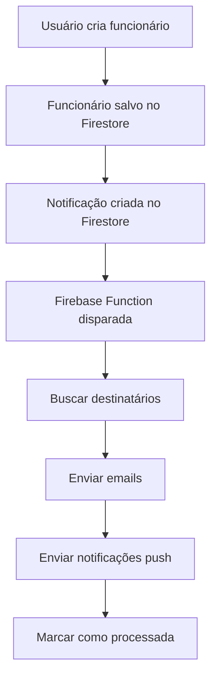

# 📧 Sistema de Notificações por Email - SGL

## 🎯 **Resumo**

Este documento explica como implementar notificações por email no Sistema de Gestão de Logística (SGL) quando eventos importantes acontecem, como a criação de um novo funcionário.

## 📋 **Status Atual**

### ✅ **Implementado:**

- Sistema de notificações push (FCM)
- Interface de configurações de notificações
- Estrutura de dados para notificações
- Firebase Functions para processamento

### 🔧 **Para Implementar:**

- Serviço de envio de emails
- Configuração de templates
- Integração com provedor de email

## 🚀 **Como Funciona**

### **1. Fluxo Completo**



### **2. Exemplo Prático**

Quando você criar um funcionário novo:

1. **Sistema salva** o funcionário no Firestore
2. **Cria notificação** na coleção `notificacoes`
3. **Firebase Function** é disparada automaticamente
4. **Busca usuários** que devem receber notificações
5. **Envia emails** para os destinatários
6. **Envia notificações push** (se configurado)

## 📧 **Opções de Serviço de Email**

### **Opção 1: SendGrid (Recomendado)**

```bash
# Instalar dependência
npm install @sendgrid/mail
```

```typescript
// functions/src/emailService.ts
import * as sgMail from "@sendgrid/mail";

export class EmailService {
  constructor() {
    sgMail.setApiKey(functions.config().sendgrid.key);
  }

  async enviarEmail(
    destinatario: string,
    assunto: string,
    corpo: string
  ): Promise<void> {
    const msg = {
      to: destinatario,
      from: "noreply@seudominio.com", // Email verificado no SendGrid
      subject: assunto,
      html: corpo,
    };

    await sgMail.send(msg);
  }
}
```

### **Opção 2: Nodemailer (Gmail/SMTP)**

```bash
# Instalar dependência
npm install nodemailer
```

```typescript
// functions/src/emailService.ts
import * as nodemailer from "nodemailer";

export class EmailService {
  private transporter: nodemailer.Transporter;

  constructor() {
    this.transporter = nodemailer.createTransporter({
      service: "gmail",
      auth: {
        user: functions.config().email.user,
        pass: functions.config().email.password,
      },
    });
  }

  async enviarEmail(
    destinatario: string,
    assunto: string,
    corpo: string
  ): Promise<void> {
    const mailOptions = {
      from: "noreply@seudominio.com",
      to: destinatario,
      subject: assunto,
      html: corpo,
    };

    await this.transporter.sendMail(mailOptions);
  }
}
```

### **Opção 3: Firebase Extensions (Mais Fácil)**

```bash
# Instalar Firebase Extension para Email
firebase ext:install firestore-send-email
```

## 🔧 **Configuração Passo a Passo**

### **Passo 1: Configurar Firebase Functions**

```bash
# Inicializar Firebase Functions (se não existir)
firebase init functions

# Instalar dependências
cd functions
npm install @sendgrid/mail
```

### **Passo 2: Configurar Variáveis de Ambiente**

```bash
# Configurar chave do SendGrid
firebase functions:config:set sendgrid.key="SUA_CHAVE_SENDGRID"

# Ou para Gmail
firebase functions:config:set email.user="seu-email@gmail.com"
firebase functions:config:set email.password="sua-senha-app"
```

### **Passo 3: Deploy das Functions**

```bash
# Deploy das functions
firebase deploy --only functions
```

## 📝 **Exemplo de Email Recebido**

Quando você criar um funcionário, receberá um email assim:

```
Assunto: Novo Funcionário Cadastrado

┌─────────────────────────────────────────────────────────┐
│                    SGL - Sistema de Gestão de Logística │
├─────────────────────────────────────────────────────────┤
│                                                         │
│  Novo Funcionário Cadastrado                           │
│  Data: 16/01/2025 14:30:25                            │
│                                                         │
│  Funcionário João Silva foi cadastrado no sistema      │
│                                                         │
│  ┌─ Detalhes do Funcionário ─────────────────────────┐ │
│  │ Nome: João Silva                                  │ │
│  │ CPF: 123.456.789-00                               │ │
│  │ Função: Motorista                                 │ │
│  │ Criado por: admin@empresa.com                     │ │
│  └───────────────────────────────────────────────────┘ │
│                                                         │
│  Esta é uma notificação automática do SGL.            │
│  Para mais informações, acesse o sistema.              │
│                                                         │
└─────────────────────────────────────────────────────────┘
```

## ⚙️ **Configurações de Usuário**

### **Estrutura no Firestore:**

```typescript
// Coleção: usuarios/{userId}
{
  email: "usuario@empresa.com",
  displayName: "Nome do Usuário",
  notificacoes: {
    email: true,        // Receber emails
    push: true,         // Receber notificações push
    funcionarios: true, // Notificações sobre funcionários
    rotas: true,        // Notificações sobre rotas
    folgas: true,       // Notificações sobre folgas
    manutencao: true    // Notificações sobre manutenção
  },
  fcmToken: "token-fcm-do-dispositivo",
  role: "admin"         // admin, gerente, dispatcher, user
}
```

### **Interface de Configurações:**

O usuário pode configurar suas preferências em:
**Configurações → Notificações**

- ✅ Notificações por Email
- ✅ Notificações Push
- ✅ Novas Rotas
- ✅ Folgas e Férias
- ✅ Manutenção de Veículos

## 🎯 **Tipos de Notificações**

### **1. Funcionários**

- ✅ Novo funcionário cadastrado
- ✅ Funcionário atualizado
- ✅ Funcionário inativado
- ✅ Funcionário reativado

### **2. Rotas**

- ✅ Nova rota criada
- ✅ Rota atribuída
- ✅ Status da rota alterado
- ✅ Rota concluída

### **3. Folgas**

- ✅ Nova solicitação de folga
- ✅ Folga aprovada/rejeitada
- ✅ Lembrete de folga próxima

### **4. Veículos**

- ✅ Manutenção programada
- ✅ Manutenção concluída
- ✅ Veículo inativo
- ✅ Documentos vencendo

## 📊 **Monitoramento**

### **Logs das Functions:**

```bash
# Ver logs das functions
firebase functions:log

# Ver logs específicos
firebase functions:log --only processarNotificacoes
```

### **Métricas no Firebase Console:**

- **Functions → Logs**: Ver execuções
- **Firestore → Dados**: Ver notificações criadas
- **Analytics**: Ver engajamento com notificações

## 🔒 **Segurança**

### **Validações:**

```typescript
// Validar se usuário tem permissão
if (!userProfile?.role || !["admin", "gerente"].includes(userProfile.role)) {
  throw new Error("Usuário sem permissão para receber notificações");
}

// Validar email
if (!email || !email.includes("@")) {
  throw new Error("Email inválido");
}
```

### **Rate Limiting:**

```typescript
// Limitar envio de emails (máximo 10 por minuto)
const rateLimit = {
  windowMs: 60 * 1000, // 1 minuto
  max: 10, // máximo 10 emails por minuto
};
```

## 💰 **Custos**

### **SendGrid:**

- **Gratuito**: 100 emails/dia
- **Pago**: $14.95/mês para 50k emails

### **Firebase Functions:**

- **Gratuito**: 125k invocações/mês
- **Pago**: $0.40 por milhão de invocações

### **Estimativa para SGL:**

- **100 funcionários**: ~50 emails/mês
- **Custo**: **GRATUITO** (dentro dos limites)

## 🚀 **Próximos Passos**

1. **Escolher provedor de email** (SendGrid recomendado)
2. **Configurar Firebase Functions**
3. **Testar com email de desenvolvimento**
4. **Configurar domínio de email**
5. **Deploy em produção**
6. **Monitorar logs e métricas**

## 📞 **Suporte**

Para dúvidas sobre implementação:

- **Documentação Firebase**: https://firebase.google.com/docs
- **SendGrid Docs**: https://sendgrid.com/docs
- **Firebase Functions**: https://firebase.google.com/docs/functions
